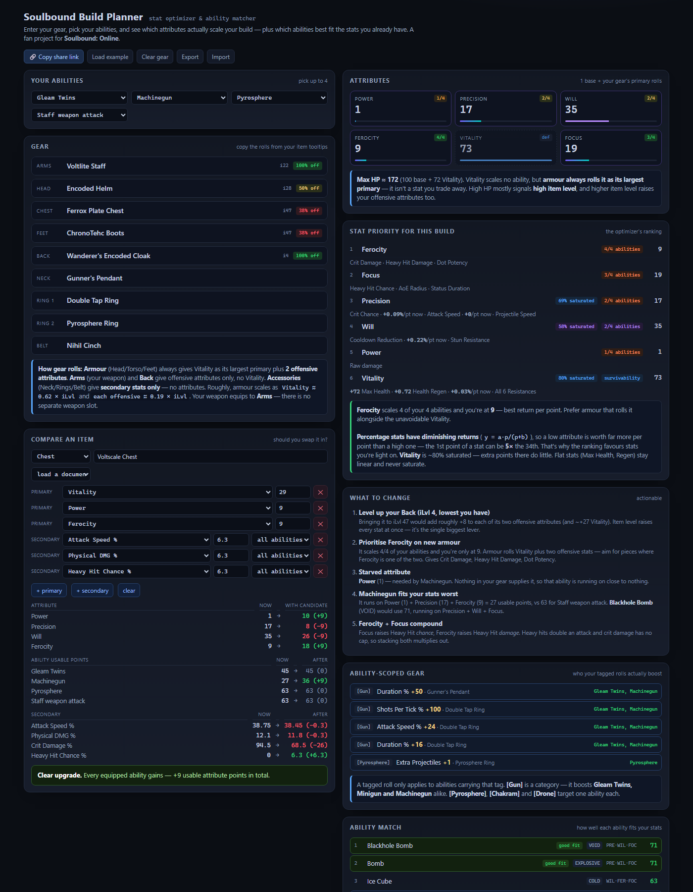
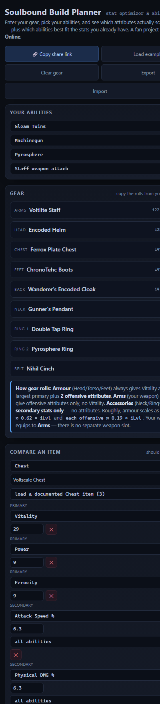

# Arcadia

A free, open-source build planner and stat optimizer for **[Soulbound: Online](https://store.steampowered.com/app/4369490/Soulbound_Online/)**.

Enter your gear and abilities, and it tells you which of the six attributes actually scale
*your* build, whether a piece of gear is an upgrade, and which abilities fit the stats you
already have.

**→ [Open Arcadia](https://arcadia.carl-prewitt.com/)**



## What it does

- **Attribute totals** from your gear, live as you type.
- **Stat priority** — ranks attributes by how many of *your* equipped abilities use them, and
  shows how saturated each one already is.
- **Compare an item** — pick a slot, enter a candidate's rolls, and get a verdict: what changes,
  which abilities gain or lose, and by how much.
- **Ability match** — scores all 15 abilities against your current stats, so you can spot one
  that's wasting your build.
- **Ability-scoped gear** — shows which of your abilities each `[Gun]`-style tagged roll actually
  boosts.
- **Share links** — the whole build encodes into the URL. Paste it in Discord; nothing is uploaded.
- **Gear library** — documented items you can load into any slot with one click.

## Things it can tell you that aren't documented elsewhere

- Every ability is scaled by **exactly three of the five offensive attributes**.
  **Vitality scales none of them** — it's health, regen and resistances only.
- **An item's level equals the sum of its primary attribute points.** Item level is a fixed
  budget; two items of the same level differ only in how that budget is split.
- **Percentage stats have diminishing returns.** The first point of an attribute can be worth
  ~5× the thirty-fourth. Flat stats (max health, regen) stay linear.
- `[Gun]` is a **category** tag — it boosts Gleam Twins, Minigun and Machinegun alike, while
  `[Pyrosphere]` or `[Chakram]` target a single ability.

## On mobile



## Running it

It's one self-contained HTML file. No build step, no dependencies, no server.

```
git clone https://github.com/rages4calm/arcadia.git
```

Open `index.html` in a browser, or drop it on any static host. Your builds are stored in your
own browser's local storage and never leave your machine.

## Contributing

The most useful contribution is **gear data**. The game has far more items than are documented
here, and the roll pools aren't published anywhere — so the library grows from real tooltips.

- Found an item that isn't in the library? Open an issue with a screenshot of the tooltip.
- Spotted a number that looks wrong? Open an issue — the in-game panel is always the authority.
- Balance changed in a patch? The values live in `ATTRS`, `ABILITIES` and `GEAR_LIB` near the
  top of the `<script>` block.

## Disclaimer

This project is an independent creation and is not affiliated with, endorsed, or sponsored by
Soulbound. View the official Fan Content Policy at
[soulbound.game/legal-portal/fan-content](https://soulbound.game/legal-portal/fan-content).

Built in accordance with the
[Third-Party Extensions & Plugins Policy](https://soulbound.game/legal-portal/third-party-extensions):
it is free, uses no game art or assets, and claims no affiliation. All game names and trademarks
belong to their respective owners. Values are community-maintained approximations that can change
with game updates — always trust your in-game stat panel over this tool.

## License

[MIT](LICENSE)
